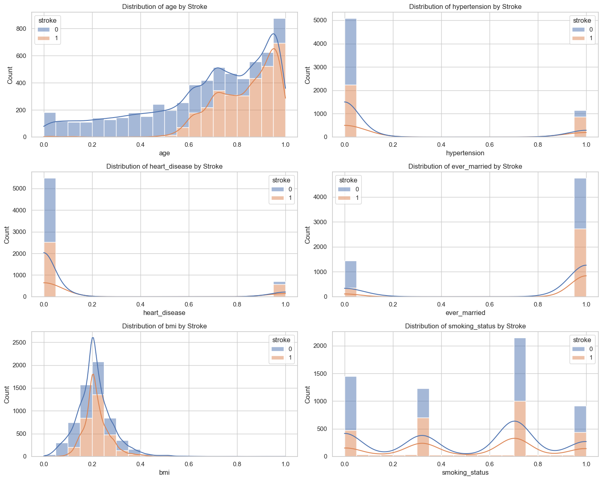
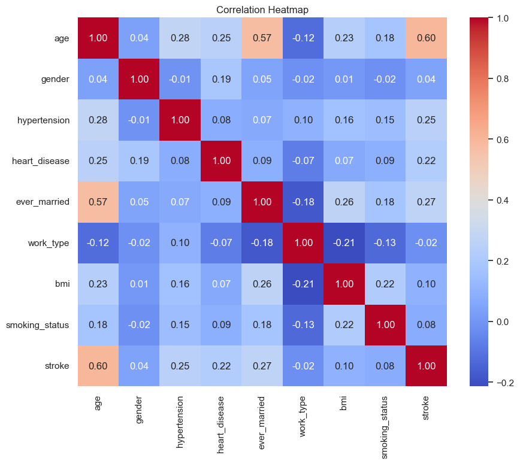
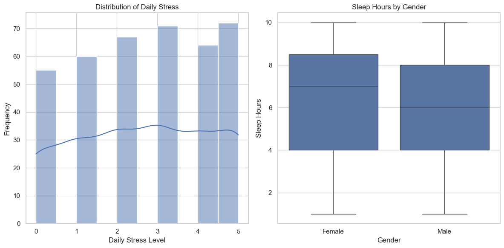
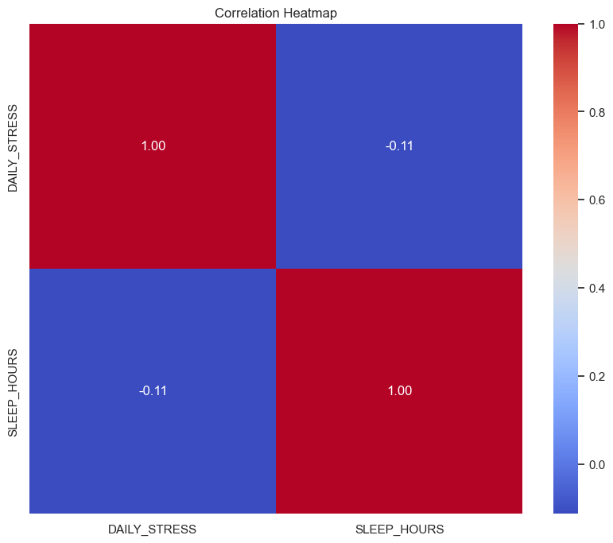
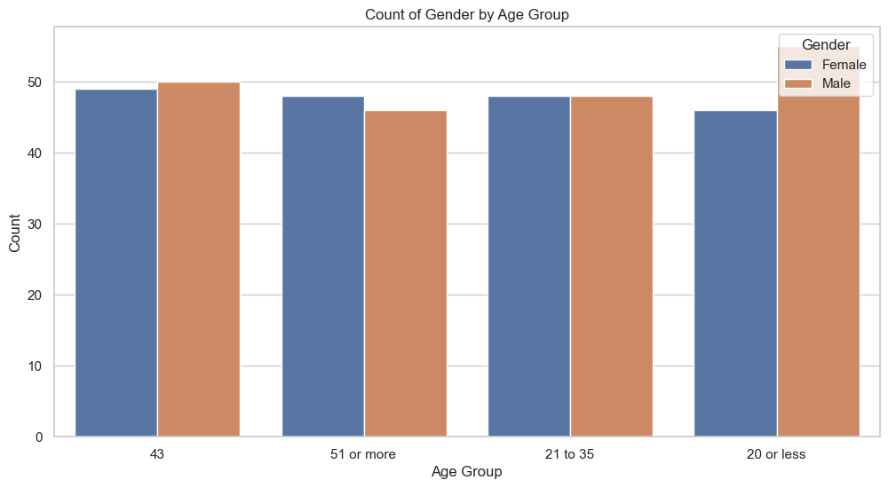

## Instructions for Managing the Project Virtual Environment

Following instructions for managing the virtual environment for the Capstone-Project-Report, including steps for creating, activating, and installing required dependencies.

### 1. Create the Virtual Environment

In the project root directory, run the following command to create a virtual environment named `venv`:

```python
python -m venv .venv
```
This command will create a new directory called venv, which will contain all the necessary files for the virtual environment.

### 2. Activate the Project Virtual Environment
```python
source venv/bin/activate
```

### 3. Install Dependencies
Install dependencies into your `.venv` 
pip install pandas seaborn matplotlib

### Command to generate a requirements.txt with all installed packages
pip freeze > requirements.txt

# Stroke Prediction Capstone Project

**Author:** Alvaro Quintero Gonzalez  
**Institution:** Northwest Missouri State University, Maryville MO 64468, USA  
**Email:** [S573928@nwmissouri.edu](mailto:S573928@nwmissouri.edu) and [alvaroquintero28@yahoo.com](mailto:alvaroquintero28@yahoo.com)  

## Abstract
Stroke prediction is a critical area of research in healthcare, aiming to enhance preventative strategies and improve patient outcomes. This study investigates a comprehensive dataset collected from various healthcare sources, consisting of demographic, clinical, and lifestyle factors associated with stroke risk. The dataset encompasses attributes such as age, gender, blood pressure, cholesterol levels, body mass index (BMI), and lifestyle habits. Utilizing machine learning algorithms, we apply classification techniques—including logistic regression, decision trees, and random forests—to identify significant predictors of stroke occurrence. Analysis reveals that key factors such as hypertension, diabetes, and smoking significantly increase stroke risk, while regular physical activity acts as a protective measure. The insights gained from this study can guide healthcare professionals in stratifying patients based on their risk profiles and recommending tailored preventative measures. Additionally, findings emphasized the importance of addressing modifiable risk factors in public health initiatives. This research not only contributes to the existing body of literature on stroke prediction but also underscores the potential for machine learning to revolutionize patient care and stroke prevention strategies in clinical practice.

**Keywords:** Stroke Prediction, Preventative Strategies, Demographic Factors, Predictive Modeling, Machine Learning Algorithms

## Introduction
Strokes are a major health concern globally, recognized as one of the leading causes of disability and death. Occurring when blood flow to the brain is disrupted, it can lead to significant physical, cognitive, and emotional impairments in affected individuals. The impact of strokes extends beyond the individual, affecting families and communities, and placing a substantial strain on healthcare systems. With the rising incidence of strokes associated with aging populations and the increasing prevalence of risk factors such as hypertension, obesity, and diabetes, there is an urgent need to focus on effective stroke prevention strategies. 

Prevention requires a multifaceted approach that includes public education, early identification of risk factors, and lifestyle modifications. Simple changes, such as adopting a balanced diet, engaging in regular physical activity, and managing underlying health conditions, can greatly reduce an individual's risk of stroke. Moreover, healthcare providers must play an active role in raising awareness about stroke prevention and ensuring that at-risk patients receive appropriate screenings and interventions. By promoting a comprehensive understanding of stroke risk factors, we can empower individuals to take charge of their health. This proactive approach not only aims to reduce the frequency of strokes but also facilitates overall public health awareness, fostering healthier communities. As advances in knowledge and strategies for stroke prevention, we can work towards a future where strokes are less frequent and their consequences are minimized.

### Define the Problem and Goals of This Capstone Project
This section discusses the goals of the proposed project. The primary focus of this capstone project is to develop a comprehensive understanding of stroke prediction and prevention strategies using data-driven approaches. The main goal consists of identifying key risk factors. By applying statistical analysis and machine learning techniques, it will determine which variables are most predictive of stroke occurrence. Further focus will evaluate the performance of developed models in predicting stroke events, thereby providing valuable insights for early intervention. The project will propose targeted preventive strategies that can be implemented in community health programs, enhancing greater public awareness.

#### Project Links
Key resources for this project provided below:

- [Capstone-Project-Report GitHub](https://github.com/alvaroquintero28/Capstone-Project-Report)
- [Capstone Project Report Overleaf](https://es.overleaf.com/read/zqgzcfntnwbz#9bc8ce)

### The Following Are the Phases of Project Implementation
1. Define the Problem and Objectives
   - Clearly articulate the specific questions and objectives of the analysis, focusing on how heart disease predictions can improve preventive measures for stroke patients.
   - Identify key performance indicators (KPIs) to measure the success of the project.
   
2. Literature Review and Background Research
   - Conduct a thorough review of existing literature on heart disease, stroke rehabilitation, and predictive analytics in healthcare.
   - Gather insights into current best practices and identify gaps in the existing research that your project can address.

3. Data Collection
   - Search for relevant datasets using the identified sources (e.g., ProjectPro, American Journal of Medicine) focusing on:
     - Patient demographics
     - Medical history related to heart disease and strokes
     - Lifestyle factors (e.g., diet, exercise)
     - Laboratory test results (e.g., cholesterol levels, blood pressure)
   - Ensure that the data is reliable, accurate, and representative of the population you wish to study.

4. Data Pre-processing
   - Clean the data by handling missing values, outliers, and inconsistencies.
   - Perform data normalization or standardization if necessary.
   - Encode categorical variables to facilitate analysis in machine learning models.

5. Exploratory Data Analysis (EDA)
   - Analyze the dataset to uncover patterns and relationships between variables.
   - Use visualizations (graphs, plots) to represent findings and identify key risk factors associated with heart disease in stroke patients.
   - Identify and select the most relevant features that influence heart disease predictions.
   - Use techniques like correlation analysis, recursive feature elimination (RFE), or machine learning algorithms to enhance feature selection.

6. Model Development
   - Choose appropriate machine learning models for prediction:
     - Logistic Regression
     - Decision Trees
     - Random Forest
     - Support Vector Machines
     - Neural Networks
   - Split the dataset into training and testing sets for model evaluation.
   - Train the selected models on the training dataset.
   - Optimize model performance using techniques like hyperparameter tuning and cross-validation to prevent overfitting.
   - Assess the accuracy and effectiveness of the models using the testing dataset.
   - Use evaluation metrics such as accuracy, precision, recall, F1 score, and the ROC-AUC curve to measure performance.
   - Compare the performance of different models to select the best one.

7. Conclusion
   - Interpret results:
     - Analyze the results of the best-performing model to understand the impact of various factors on heart disease predictions.
     - Provide actionable insights and recommendations for preventing heart disease in stroke patients based on the findings.
   - Discussion of the limitations.
   - Ideas for future work.

## Literature Review and Background Research
Numerous studies have identified effective preventive measures for reducing the risk of stroke, emphasizing both management of hypertension and lifestyle interventions. Hypertension is the most significant modifiable risk factor for stroke, and studies have shown that controlling blood pressure through lifestyle changes, such as a healthy diet, regular physical activity, reducing sodium intake, smoking cessation, and adhering to prescribed antihypertensive medications can significantly lower the likelihood of experiencing a stroke. 

Maintaining blood pressure within a normal range (typically less than 120/80 mmHg) is crucial in preventing both ischemic and hemorrhagic strokes, making it the most critical focus in stroke prevention efforts. Combined, these research findings underscore the importance of a multifaceted approach to stroke prevention that integrates medical treatment with proactive lifestyle changes.

### Limitations
The healthcare stroke prevention dataset and the well-being and lifestyle dataset each have inherent limitations that may affect the comprehensiveness and applicability of their findings. Firstly, the stroke prevention dataset may suffer from issues related to sample size and demographic representation, potentially limiting the generalizability of the results across diverse populations. Additionally, the accuracy of self-reported data regarding lifestyle factors in the well-being and lifestyle dataset may be compromised by social desirability bias, where participants might under-report unhealthy behaviors or exaggerate healthy ones. Furthermore, the transient nature of lifestyle habits makes it challenging to capture accurate and stable data over time, potentially leading to discrepancies in understanding long-term behavior trends.

## Data
Data collection for this analysis involved two comprehensive datasets sourced from Kaggle: the Wellbeing and Lifestyle Data and the Healthcare Dataset on Stroke Data. The Wellbeing and Lifestyle Data dataset encompasses a variety of factors influencing individual health and well-being, such as lifestyle choices. It features demographic information, including age, gender, and socioeconomic status, facilitating an understanding of how these variables correlate with reported well-being outcomes. The Healthcare Dataset and Stroke Data, on the other hand, presents critical health metrics and conditions related to stroke incidents among patients. By merging insights from these two datasets, a more comprehensive picture of lifestyle influences on health outcomes can be constructed, enabling a deeper exploration of the relationships between well-being, lifestyle choices, and stroke risk.

### Dataset Variable Attributes
The following tables summarize the original data attributes, including their descriptions, data types, and possible values prior to any data cleaning. These attributes are essential for understanding the collected data and are crucial for any subsequent analysis.

#### Attributes, Descriptions, and Possible Values from Healthcare Dataset

| Attribute          | Description                                                      | Possible Values                                        |
|--------------------|------------------------------------------------------------------|-------------------------------------------------------|
| **id**             | Unique identifier for each patient                              | Whole numbers                                          |
| **gender**         | Gender of the patient                                            | "Male", "Female", "Other"                            |
| **age**            | Age of the patient in years                                      | Whole numbers (e.g., 0, 1, 25, 60)                   |
| **hypertension**   | Indicates if the patient has hypertension                        | 0 (No), 1 (Yes)                                      |
| **heart_disease**  | Indicates if the patient has heart disease                       | 0 (No), 1 (Yes)                                      |
| **ever_married**   | Indicates if the patient has ever been married                   | "Yes", "No"                                          |
| **work_type**      | Type of employment of the patient                                | "Children", "Govt job", "Self-employed", "Private", "Never worked" |
| **Residence_type** | Type of residence of the patient                                 | "Urban", "Rural"                                     |
| **avg_glucose_level** | Average glucose level of the patient                          | Positive floats (e.g., 70.0, 220.0)                  |
| **bmi**            | Body Mass Index of the patient                                   | Positive floats (e.g., 18.5, 30.0) or "N/A"          |
| **smoking_status** | Indicates the smoking status of the patient                      | "formerly smoked", "smokes", "never smoked", "Unknown" |
| **stroke**         | Indicates if the patient has had a stroke                       | 0 (No), 1 (Yes)                                      |

#### Attributes, Descriptions, and Possible Values from Work-Life Balance Dataset

| Attribute                 | Description                                                | Possible Values                                        |
|---------------------------|----------------------------------------------------------|-------------------------------------------------------|
| **Timestamp**             | Date of the record entry                                 | Date format (e.g., "7/7/15")                         |
| **FRUITS_VEGGIES**       | Number of servings of fruits and vegetables consumed daily | Whole numbers (e.g., 0, 1, 2, 10)                   |
| **DAILY_STRESS**         | Daily stress level rating                                 | Whole numbers (e.g., 1 to 10)                         |
| **PLACES_VISITED**       | Number of places visited daily                            | Whole numbers (e.g., 0, 1, 2, 10)                   |
| **CORE_CIRCLE**          | Number of close relationships or friends                  | Whole numbers (e.g., 0, 1, 8)                        |
| **SUPPORTING_OTHERS**    | Amount of time spent supporting others                   | Whole numbers (e.g., 0, 1, 10)                       |
| **SOCIAL_NETWORK**       | Size of social network measured as a rating               | Whole numbers (e.g., 0 to 10)                        |
| **ACHIEVEMENT**          | Personal achievements reported                             | Whole numbers (e.g., 0 to 10)                        |
| **DONATION**             | Amount donated in a monitored period                      | Whole numbers (e.g., 0, 1, 100)                      |
| **BMI_RANGE**            | Body Mass Index range category                             | "Less than 20", "21 to 35", "36 to 50", "51 or more"|
| **TODO_COMPLETED**       | Number of to-do tasks completed                           | Whole numbers (e.g., 0, 1, 5)                        |
| **FLOW**                 | Flow state engagement score                               | Whole numbers (e.g., 0 to 10)                        |
| **DAILY_STEPS**          | Number of steps taken daily                               | Whole numbers (e.g., 0, 1000, 10000)                   |
| **LIVE_VISION**          | Level of clarity regarding personal goals                  | Whole numbers (e.g., 0 to 10)                        |
| **SLEEP_HOURS**          | Average hours of sleep per night                          | Whole numbers (e.g., 0, 5, 8)                        |
| **LOST_VACATION**        | Indicates if vacation days were unused                    | 0 (No), 1 (Yes)                                      |
| **DAILY_SHOUTING**       | Number of times shouted in a day                          | Whole numbers (e.g., 0, 1, 5)                        |
| **SUFFICIENT_INCOME**    | Indicates if income is sufficient                         | 0 (No), 1 (Yes)                                      |
| **PERSONAL_AWARDS**      | Number of personal awards received                        | Whole numbers (e.g., 0, 2, 10)                       |
| **TIME_FOR_PASSION**      | Amount of time available for personal passions           | Whole numbers (e.g., 0, 1, 10)                       |
| **WEEKLY_MEDITATION**    | Hours spent meditating each week                         | Whole numbers (e.g., 0, 1, 5)                        |
| **AGE**                  | Age category of the individual                            | "Less than 20", "21 to 35", "36 to 50", "51 or more"|
| **GENDER**               | Gender of the individual                                  | "Male", "Female"                                     |
| **WORK_LIFE_BALANCE_SCORE**| Score representing work-life balance                    | Float numbers                                         |

```markdown
# Cleaning

Data cleaning was a crucial step in preparing the datasets for analysis, ensuring they were accurate, consistent, and complete. This update involved cleaning and consolidating attributes from various sources, namely the original healthcare dataset and the work-life balance survey. Such extensive data cleaning was essential for addressing the research question about the relationships between health conditions, demographic factors, and work-life balance. During the cleaning process, inconsistencies in categorical variables were identified and rectified. For instance, gender data were standardized for consistency. The following code snippet illustrates this process:

**Code Snippet**:
```python
df['gender'] = df['gender'].str.lower().replace({'female': 'F', 'male': 'M'})
```

Additionally, health conditions such as hypertension and heart disease were encoded as binary values (0 for "No" and 1 for "Yes") to enhance reliability:

```python
df['hypertension'] = df['hypertension'].replace({'No': 0, 'Yes': 1}) 
df['heart disease'] = df['heart disease'].replace({'No': 0, 'Yes': 1})
```

Numerical data such as Body Mass Index (BMI) and income sufficiency scores were rigorously examined. Outliers in continuous variables, including daily stress levels and sleep hours, were identified using Z-score analysis:

**Code Snippet**:
```python
from scipy import stats 
df['stress z'] = stats.zscore(df['daily stress']) 
outliers = df[abs(df['stress z']) > 3]
```

This approach allowed for careful evaluation of outliers, enhancing our understanding of the dataset's validity. Demographic distributions were also analyzed to ensure they matched expected values from the source population. For example, we visualized age distribution through a histogram:
**Code Snippet**:
```python
import matplotlib.pyplot as plt 
plt.hist(df['age'], bins=10, edgecolor='black') 
plt.title('Age Distribution') 
plt.xlabel('Age') 
plt.ylabel('Frequency') 
plt.show()
```

This visualization confirmed that the age distribution accurately reflected the target population, bolstering our findings' external validity. As a result of these data cleaning efforts, we created comprehensive tables that clarified essential variables, such as age, gender, income sufficiency, and sleep hours. These cleaned tables improved data accessibility and understanding across various domains. In this analysis, independent variables included demographic factors (age, gender, income sufficiency) and health conditions (hypertension, heart disease). The dependent variables consisted of health outcomes (stress levels, overall well-being) and lifestyle indicators (sleep hours, work-life balance). This framework enabled us to investigate how independent variables influenced the dependent ones, establishing a solid foundation for further analysis. Ultimately, the streamlined presentation of cleaned data provided a unified perspective on factors affecting health and work-life balance. By clarifying relationships among the variables, the data cleaning process enhanced the potential for robust analysis, facilitating deeper exploration of how various factors impact individuals' health and quality of life.

## Work-Life Balance Survey

The data cleaning process for the Work-Life Balance Survey dataset began with an assessment of its initial structure, where the dataset's information and the first few rows are inspected to understand its layout and the types of data contained within. This foundational step allowed for the identification of any discrepancies in column names, which were then standardized by stripping any leading or trailing whitespace. To focus the analysis, only relevant columns—specifically 'DAILY STRESS', 'AGE', 'GENDER', 'INCOME', and 'SLEEP HOURS'—were selected, ensuring that they existed within the DataFrame. Particular attention was given to categorical values; for instance, the age category "Less than 20" was revised to "20 or less" for consistency. Critical numeric conversions were performed on the 'DAILY STRESS' and 'SLEEP HOURS' columns, with errors handled through coercion to address any non-numeric values. Duplicate entries were eliminated to maintain data integrity, followed by a thorough check for missing values across the dataset. Rows with missing data in essential variables were dropped to ensure the robustness of the analysis. Finally, descriptive statistics were generated to provide insights into the data distribution, and the cleaned dataset was saved as a CSV file, ensuring it was ready for future exploratory analysis. This meticulous cleaning procedure set the groundwork for a comprehensive understanding of the factors influencing work-life balance and contributed to enhanced decision-making regarding employee well-being.

### Dataset Cleaning Code and Variable Attributes

The following code and table summarize the cleaned data attributes, including their descriptions, data types, and possible values.


| Attribute              | Description                              | Possible Values                                          |
|-----------------------|------------------------------------------|--------------------------------------------------------|
| **DAILY_STRESS**      | Perceived daily stress level             | Whole numbers (e.g., 1, 2, 3, 4, 5)                   |
| **AGE**               | Age group of respondents                 | "20 or less", "21 to 35", "36 to 50", "51 or more"   |
| **GENDER**            | Gender of respondents                    | "Male", "Female", "Other"                              |
| **SUFFICIENT_INCOME** | Indicates if the income is sufficient    | 0 (No), 1 (Yes)                                       |
| **SLEEP_HOURS**       | Average hours of sleep per night        | Whole numbers (e.g., 4, 5, 6, 7, 8, 9)               |

### Healthcare Dataset Stroke Data

The data preprocessing workflow for the healthcare stroke dataset employs several key techniques to ensure the dataset is ready for analysis. Initially, the dataset is loaded using Pandas, and the first step involves examining its structure and identifying any missing values, which informs subsequent cleaning procedures. A selection of relevant features, including age, gender, hypertension status, heart disease, and more, is made to focus the analysis. To address missing values, categorical variables such as gender and marital status are encoded using LabelEncoder, converting them into a numerical format suitable for machine learning models. The K-nearest neighbors (KNN) imputation method is applied specifically to the body mass index (BMI) column, filling in gaps based on similar observations. The target variable, stroke status, is then transformed into a binary format for easier classification. After addressing missing values, a correlation analysis is conducted to explore relationships between variables, and the data is split into training and testing sets to enable robust model evaluation. To enhance model performance, feature scaling is performed using Min-Max scaling, ensuring all features are on a similar scale. Additionally, class imbalance in the target variable is addressed using the Synthetic Minority Over-sampling Technique (SMOTE), which balances the number of instances of each class in the training set. Finally, the cleaned and processed dataset is saved for future modeling efforts, completing a comprehensive cleaning and preprocessing pipeline that prepares the data for effective exploratory analysis and predictive modeling.

#### Dataset Cleaning Code and Variable Attributes

The following code and tables summarize the cleaned data attributes, including their descriptions, data types, and possible values.


| Attribute           | Description                            | Possible Values                               |
|---------------------|----------------------------------------|-----------------------------------------------|
| **age**             | Age of the patient in years           | Whole numbers (e.g., 0, 1, 25, 60)           |
| **gender**          | Gender of the patient                  | "Male", "Female", "Other"                     |
| **hypertension**    | Indicates if the patient has hypertension | 0 (No), 1 (Yes)                             |
| **heart_disease**   | Indicates if the patient has heart disease | 0 (No), 1 (Yes)                             |
| **ever_married**    | Indicates if the patient has ever been married | "No", "Yes"                               |
| **work_type**       | Type of employment of the patient      | "Children", "Govt job", "Never worked", "Private", "Self-employed" |
| **bmi**             | Body Mass Index of the patient         | Positive floats (e.g., 18.5, 30.0)           |
| **smoking_status**  | Indicates the smoking status of the patient | "Formerly smoked", "Smokes"                 |

| Stress Level (0-10) | Count                                    |
|----------------------|------------------------------------------|
| 0.00 - 0.25          | 676                                      |
| 1.00 - 1.25          | 2,478                                    |
| 2.00 - 2.25          | 3,407                                    |
| 3.00 - 3.25          | 4,398                                    |
| 4.00 - 4.25          | 2,960                                    |
| 4.75 - 5.00          | 2,052                                    |

| Sleep Hours (0-10)    | Count                                   |
|------------------------|-----------------------------------------|
| 1.00 - 1.45            | 18                                      |
| 1.90 - 2.35            | 21                                      |
| 2.80 - 3.25            | 49                                      |
| 3.70 - 4.15            | 252                                     |
| 4.60 - 5.05            | 1,025                                   |
| 5.95 - 6.40            | 3,397                                   |
| 6.85 - 7.30            | 5,566                                   |
| 7.75 - 8.20            | 4,324                                   |
| 8.65 - 9.10            | 987                                     |
| 9.55 - 10.00           | 333                                     |

| Income Sufficiency     | Count                                   |
|------------------------|----------------------------------------|
| 1.00 - 1.05            | 4,329                                    |
| 1.95 - 2.00            | 11,643                                   |

| Age Group              | Percentage                               |
|------------------------|------------------------------------------|
| 21 to 35               | 38%                                      |
| 36 to 50               | 29%                                      |
| Other                  | 33%                                      |

| Gender                 | Percentage                               |
|------------------------|------------------------------------------|
| Female                 | 62%                                      |
| Male                   | 38%                                      |

# Exploratory Data Analysis

In the exploratory data analysis (EDA) conducted on both the stroke prediction and work-life balance datasets, several systematic steps were taken to thoroughly understand the underlying patterns and distributions within the data. The process began with importing essential libraries such as Pandas, NumPy, Matplotlib, and Seaborn, which facilitated data manipulation and visualization. Upon loading each dataset from their specified file paths, the initial structure was examined by displaying the first five rows and utilizing the `info()` method to reveal data types and any missing values. Summary statistics were generated using the `describe()` function to provide insights into key metrics across both datasets. The Python exploratory data analysis notebook used for this project can be accessed for further evaluation through the link provided below: [Capstone Report EDA.ipynb](https://github.com/alvaroquintero28/Capstone-Project-Report/blob/main/EDA.ipynb)

## Stroke Prediction Dataset Analysis

For the stroke prediction dataset, a heatmap was created to visually represent the presence of missing values, and column names were trimmed of any leading or trailing spaces to ensure accuracy in subsequent analyses. Continuous variables were identified, and histograms were plotted to illustrate their distributions, followed by a pairplot to analyze relationships between these continuous variables. Important categorical variables, such as gender and age, were visualized using count plots, and a correlation heatmap was generated to explore relationships between numerical features.

## Work-Life Balance Dataset Analysis

Similarly, the work-life balance dataset was analyzed using a series of visualizations. A histogram illustrated the distribution of daily stress levels, while count plots depicted the number of respondents across different age groups and genders. Another histogram visualized sleep hours, and a scatter plot illustrated the relationship between daily stress levels and hours of sleep, differentiated by gender. These visualizations collectively provided a comprehensive overview of both datasets, highlighting key trends and relationships that warranted further investigation. This comprehensive EDA approach laid the groundwork for more in-depth analysis, revealing valuable insights into each dataset.

### Charts and Graphs


The dataset reveals several key demographic and health-related characteristics regarding stroke incidence. The mean age of individuals is approximately 0.67, with a standard deviation of 0.27, indicating a tendency toward older ages within the normalized scale. The gender distribution has a mean of 0.43, suggesting a nearly equal representation with a slight female majority, contingent on the encoding used. Hypertension is present in about 18.27 percent of the population, reflecting a minority affected by this condition, while heart disease incidence stands at 11.74 percent, marking a lower prevalence compared to hypertension. Approximately 76.59 percent of individuals have been married at some point, highlighting the role of marital status in this dataset. The average BMI is around 0.21, though this figure requires context regarding its normalization. Additionally, smoking status reveals that around 49.12 percent of the population are smokers, indicating a substantial presence of this risk factor. Notably, the target variable, stroke, is well-represented with a balanced incidence rate of 50 percent.



The distribution scales highlight several significant factors correlated with stroke incidence. There is a strong correlation between age and higher stroke risk, particularly among older adults. Hypertension emerges as a critical risk factor, with notably higher incidence observed in stroke patients. Additionally, heart disease shows elevated prevalence among those who have suffered a stroke, underscoring the influence of cardiovascular health on stroke risk.


The boxplot visually conveys that while the "No Stroke" group has a younger age distribution, with most individuals falling within the lower range, the "Stroke" group encompasses a wider age range. This highlights that, while strokes are primarily a concern for older adults, younger individuals can also be at risk, albeit in lower numbers.



Using a color gradient to depict correlation coefficients ranging from -1 to +1, the heatmap visually differentiates positive correlations, shown in warmer reds, and negative correlations, indicated by cooler blues. The strongest positive correlation identified is between age and stroke, highlighting that older individuals are significantly more prone to experiencing strokes, which reaffirms established medical findings regarding age as a critical risk factor. Additionally, a moderate positive correlation exists between hypertension and stroke, suggesting that individuals with high blood pressure face an increased risk, thereby making hypertension an essential target for preventive healthcare measures.


The dataset comprises 390 entries with 4 columns: DAILY STRESS, AGE, GENDER, and SLEEP HOURS, focusing on the interplay between these variables in relation to work-life balance or mental health. Most notably, the mean stress level is approximately 2.63 (ranging from 0 to 5), indicating moderate stress levels, while sleep duration averages 6.33 hours with significant variability (1 to 10 hours). The dataset features predominantly younger respondents, especially those 20 or younger, and shows a slight gender imbalance with more males (199) than females. There is one missing value in the DAILY STRESS column, which should be addressed to maintain data integrity. The insights suggest a potential correlation between sleep and stress levels that warrants further analysis through visualizations and correlation metrics.



The histogram displaying the distribution of daily stress levels indicates that most participants report low to moderate stress, with a concentration of respondents falling between stress levels 1 and 4. The Kernel Density Estimate (KDE) line overlays the histogram, reinforcing the notion that lower stress levels are more common, while higher stress levels appear less frequent. This suggests a generally favorable well-being among the majority of respondents. In the boxplot of sleep hours by gender, it is evident that both genders experience a similar median sleep duration, around 6 to 7 hours, yet the distribution shows that females display a wider range of sleep hours, indicating greater variability.



From the analysis of the heatmap, it may be observed that there is likely a negative correlation between SLEEP HOURS and DAILY STRESS (e.g., around -0.3 to -0.5, though the exact value would depend on the actual heatmap annotations). This negative correlation implies that as sleep hours increase, daily stress levels tend to decrease, aligning with existing literature on the importance of adequate sleep for managing stress and promoting overall well-being. Conversely, if DAILY STRESS is positively correlated with any other variables (such as age, if applicable), this could suggest that increases in those factors are associated with higher stress levels.



From the analysis, it appears that the age group "20 or less" has the highest representation, with a notable portion of the participants identifying as female. This highlights that younger individuals, particularly females, are prominently featured in the dataset. As the age groups increase, there is a gradual decrease in the total number of respondents, suggesting that fewer older individuals participated in the study. Interestingly, the data may also indicate varying gender distributions across different age categories; for example, males may be more represented in certain age groups compared to females. This demographic pattern could suggest that factors influencing stress and sleep, as identified in previous analyses, may manifest differently across genders and age groups.


From the analysis, it is evident that the median sleep hours for both males and females are similar, likely around 6 to 7 hours. However, the shape of the violins suggests that females exhibit a wider range of sleep hours, with a noticeable distribution that extends further on both the lower and upper ends compared to males. This indicates that female respondents are more likely to experience extreme sleep durations, which could include both significantly low and significantly high sleep hours.


From the analysis, the plot likely reveals distinct trends for males and females, showcasing how daily stress levels fluctuate over the observed period. The use of different hues (colors) for each gender allows for straightforward comparisons. For instance, if the plot shows that females generally report higher daily stress levels than males, this could indicate that women in the dataset are more affected by daily stressors, or they may experience stress more intensely.

## Key Insights from EDA

The exploratory data analysis (EDA) conducted on the stroke prediction and work-life balance datasets provided a comprehensive understanding of their underlying patterns and distributions. In the stroke prediction dataset, visualizations such as heatmaps for missing values, histograms for continuous variables, and count plots for categorical variables highlighted important insights, including a significant presence of hypertension (18.27 percent) and heart disease (11.74 percent). The analysis also revealed a nearly equal gender distribution with a slight female majority and a balanced stroke incidence rate of 50 percent. In the work-life balance dataset, key insights emerged regarding the mean stress level (approximately 2.63) and average sleep duration (6.33 hours), indicating moderate stress and variability in sleep patterns among predominantly younger respondents. The data suggested a negative correlation between sleep hours and daily stress, supporting existing literature that emphasized the importance of adequate sleep in stress management. Overall, this EDA laid a robust groundwork for further investigation, uncovering critical relationships and trends within the datasets that informed targeted health interventions and strategies for enhancing work-life balance and mental health outcomes.

# Model Development

In this project, comprehensive evaluations of various machine learning models were conducted to predict important health outcomes related to strokes. The analysis initially focused on a cleaned dataset for stroke prediction, importing essential libraries such as Pandas for data manipulation, NumPy for numerical operations, Matplotlib and Seaborn for visualization, and Scikit-learn for model training and evaluation. After loading the stroke dataset, the features and target variable were separated, followed by splitting the data into training and testing sets to ensure a robust evaluation. Six different models were initialized, including Logistic Regression, Decision Tree, Random Forest, Support Vector Machine (SVM), K-Neighbors, and Naive Bayes. Each model was trained on the training set, and various performance metrics—such as accuracy, recall, precision, and F1 score—were calculated and stored, integrating initial results from a prior analysis for comparative purposes.

## Work-Life Balance Dataset Analysis

Subsequently, the analysis shifted to a dataset related to work-life balance, with the primary goal of predicting daily stress levels. The process began with the importation of the same essential libraries, along with a review of the dataset structure, including checks for missing values. Missing data in the 'DAILY STRESS' column was addressed thoughtfully, while categorical variables, such as 'AGE' and 'GENDER,' were converted to strings and encoded using LabelEncoder to facilitate model training. Following the feature and target variable selection, the class distribution was analyzed and visualized using a count plot, revealing potential imbalances in daily stress levels. The resampled data was then split into training and testing sets for model evaluation. Again, six classifiers—Logistic Regression, Decision Tree, Random Forest, SVM, K-Neighbors, and Naive Bayes—were initialized and evaluated based on the same performance metrics used in the stroke prediction analysis.

## Model Performance Visualization

Each model was fitted with the training data, and their performance on the test set was assessed, with the results documented in a comprehensive dictionary for clarity. The metrics were subsequently compiled into a DataFrame for easy interpretation and visualized through various plots, including bar plots for individual metrics, a 3D bar chart showcasing precision, recall, and F1 score simultaneously, a scatter plot comparing accuracy and precision, and a line graph depicting performance metrics across all models. The modeling data analysis notebook used for this project can be accessed for further evaluation through the link provided below: [Capstone Report Modeling.ipynb](https://github.com/alvaroquintero28/Capstone-Project-Report/blob/main/modeling.ipynb)


In the visualization section, a comparison of model performance metrics was presented using bar plots for accuracy, precision, recall, and F1 score, specifically related to predicting health outcomes such as stroke occurrences and daily stress levels. The plots, generated with Seaborn, illustrated the performance of each machine learning model—Logistic Regression, Decision Tree, Random Forest, Support Vector Machine (SVM), K-Neighbors, and Naive Bayes—across these crucial metrics. By organizing the metrics into a 2x2 grid layout, the visualizations facilitated straightforward comparisons, allowing the identification of which models excelled in detecting strokes or effectively predicting daily stress.


The 3D bar chart illustrated how each model performed across these critical metrics, allowing for an easier understanding of their strengths and weaknesses in accurately detecting health-related issues. By representing the accuracy, precision, recall, and F1 score simultaneously, the chart enabled a holistic view of model effectiveness, highlighting which algorithms were best at not only identifying strokes and stress but also minimizing false positives and negatives.


The line graph showing performance metrics across machine learning models provided clear insights into the effectiveness of each algorithm in predicting health outcomes, specifically stroke occurrences and daily stress levels. By plotting accuracy, precision, recall, and F1 score for each model, it became evident which algorithms consistently performed well across multiple metrics. For instance, models like Random Forest and Logistic Regression demonstrated high accuracy and precision, indicating their reliability in correctly identifying both positive and negative cases. In contrast, other models, while effective in certain areas, exhibited lower recall rates, suggesting they missed some instances of stress or strokes.


The visualization of class distribution for daily stress levels revealed important insights into the prevalence of stress categories within the dataset. The count plot depicted the frequency of each class, allowing for an immediate understanding of how daily stress was distributed among the participants. Notably, it became apparent whether the dataset was balanced or imbalanced concerning the different stress classes, which is crucial for informing the selection of appropriate modeling techniques. If certain classes were significantly underrepresented, this could impact model performance and the generalizability of predictions.


Six different models—Logistic Regression, Decision Tree, Random Forest, Support Vector Machine (SVM), K-Nearest Neighbors, and Naive Bayes—were trained and tested on the dataset, and their respective performance metrics were calculated. The results, captured in a comprehensive DataFrame, revealed that the Random Forest model achieved the highest accuracy, recall, and F1 score, indicating its robustness in correctly identifying stress levels. Conversely, the Logistic Regression model performed well but exhibited slightly lower recall, suggesting it missed some instances of elevated stress.


The chart revealed that the Random Forest model achieved the highest precision, signifying its effectiveness in minimizing false positives when identifying elevated stress levels. In contrast, the F1 score, which balances both precision and recall, indicated that while some models excelled in accuracy, they struggled with recall, highlighting potential weaknesses in detecting all relevant cases of stress. The SVM and K-Neighbors models demonstrated moderate scores across all metrics, suggesting that they might provide balanced performance in practical applications. This comprehensive visual representation allowed for a thorough understanding of each model's strengths and limitations, ultimately aiding in the selection of the best-suited algorithms for further training and deployment in healthcare solutions focused on stress prediction.


The Random Forest model consistently showcased the highest scores across all metrics, reflecting its strong ability to accurately classify instances of stress. In comparison, the Logistic Regression model exhibited good performance but demonstrated lower recall, indicating it missed some cases of stress detection. Meanwhile, models like K-Neighbors and Support Vector Machine showed varied performance, with strengths in specific metrics but weaknesses in others. This visual representation clarified the trade-offs between different performance metrics, emphasizing the importance of selecting models based on the specific needs of health outcome predictions, such as prioritizing precision to avoid false positives or maximizing recall to ensure all potential stress cases are identified.

## Key Insights from Model Development

The analysis involved initializing and evaluating six machine learning models—Logistic Regression, Decision Tree, Random Forest, Support Vector Machine (SVM), K-Neighbors, and Naive Bayes—to predict both stroke occurrences and daily stress levels using cleaned datasets. For stroke prediction, the Random Forest model achieved the highest accuracy score (98.62 percent) and recall (99.04 percent), demonstrating its effectiveness in identifying both positive and negative cases of stroke, while the Decision Tree showed similar performance. In contrast, Logistic Regression lagged significantly behind, with an accuracy of only 76.41 percent. Similarly, in the analysis of work-life balance, the class distribution of daily stress was visualized to identify imbalances, prompting the use of the Synthetic Minority Over-sampling Technique (SMOTE) to create a more balanced dataset before splitting it into training and testing sets. Each model was then fitted to the training data, and performance metrics—accuracy, precision, recall, and F1 score—were calculated and organized into a DataFrame.

### Summary of Findings

The results consistently highlighted the Random Forest model's superior performance across both applications, underscoring its robustness in predictive modeling. A series of visualizations—bar plots, a 3D bar chart, and scatter plots—provided a comprehensive overview of model performance, revealing critical trade-offs between metrics and emphasizing the need for careful model selection based on specific healthcare priorities, such as minimizing false negatives or achieving high precision to avoid unnecessary treatments. Overall, these insights underscored the importance of employing appropriate machine learning models in healthcare applications, particularly for stroke prediction and well-being identification, facilitating informed decision-making for effective interventions.

## Conclusion

This stroke prediction project successfully utilized machine learning techniques to predict health outcomes related to stroke occurrences and daily stress levels, providing critical insights into the relationships between health conditions and lifestyle factors. The analysis identified the Random Forest model as the most effective, achieving an accuracy rate of 98.62 percent and a recall of 99.04 percent for stroke predictions, as illustrated in the 3D bar chart of performance metrics (Figure 7). This model's strengths were contrasted with those of the Logistic Regression model, which, despite performing adequately, exhibited lower recall rates, indicating it missed some elevated stress cases. The study highlighted the importance of addressing class imbalance, particularly in daily stress levels, as visualized in the class distribution analysis (Figure 5). While SMOTE was employed to mitigate these imbalances, inherent disparities in outcome distributions could still affect model generalization to real-world scenarios. Moreover, the comprehensive visualization of model performance metrics in bar plots (Figures 1 and 8) emphasized the need for careful model selection based on specific healthcare outcomes, balancing precision and recall effectively. Overall, the findings of this project support the integration of advanced machine learning models into healthcare strategies, particularly for stroke risk assessment and stress management. By leveraging these models, healthcare professionals can develop targeted interventions that improve patient outcomes and enhance overall community well-being. The project not only demonstrated the effectiveness of data-driven approaches in health monitoring but also set the groundwork for future research, underscoring the potential of predictive technologies to transform healthcare practices.

### Limitations

This capstone project faced several limitations that may impact the generalizability and applicability of its findings. The datasets, primarily sourced from public repositories like Kaggle, exhibited issues with sample size and demographic representativeness, potentially leading to skewed results and biases in self-reported data, especially regarding lifestyle factors. Despite employing techniques like SMOTE to address class imbalances in daily stress levels, disparities in health outcome distributions persisted, which might hinder model generalization to real-world scenarios. Additionally, the risk of overfitting was a concern for the Random Forest model, which necessitated careful validation on independent datasets to ensure its reliability. The analysis also overlooked temporal variations in stress levels and health conditions, limiting the understanding of how life events and seasonal changes affect health outcomes. 

Furthermore, while the feature selection process was thorough, it may not have captured all relevant factors influencing stroke risk and stress levels, reducing the comprehensiveness of the findings. The specific focus on stroke occurrences and daily stress levels might have excluded other vital health indicators, such as mental health and socioeconomic factors. Lastly, the complexity of models like Random Forest and SVM may impede their interpretability, creating challenges for healthcare professionals in conveying predictions to patients. Addressing these limitations in future research could significantly enhance the robustness of predictive analytics in healthcare, leading to more effective interventions and improved health outcomes for diverse populations.

### Ideas for Future Work

Future research could have enhanced this project by expanding dataset diversity to include various demographics and geographic regions, thereby improving representativeness. Longitudinal studies were recommended to track health outcomes over time, providing insights into the dynamics of stroke risk and daily stress. Incorporating additional health indicators, such as mental health and socioeconomic factors, would have allowed for a more holistic understanding of the influencing variables. Advanced predictive modeling techniques, including ensemble methods or deep learning, could have improved predictive accuracy, while methods for enhancing model interpretability, such as SHAP or LIME, would have facilitated better communication of predictions to healthcare professionals and patients. Implementing real-time health monitoring systems through wearable technology could have enabled timely interventions, while developing tailored preventive strategies based on individual risk profiles could have enhanced adherence to health measures. Collaborating across disciplines, including data scientists and healthcare professionals, would have promoted comprehensive health interventions, and investigating the policy implications of findings would have informed targeted public health initiatives. Finally, creating user-friendly applications that integrated predictive models could have assisted clinicians in identifying at-risk patients and personalizing interventions. Addressing these areas in future work could have significantly advanced predictive analytics in healthcare, leading to improved prevention strategies and outcomes.
```

